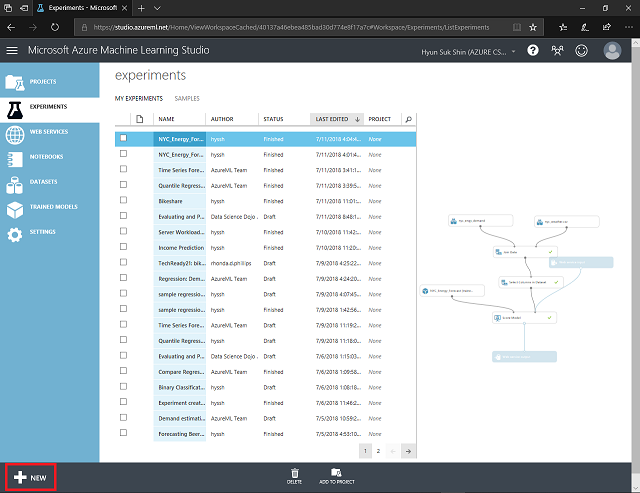
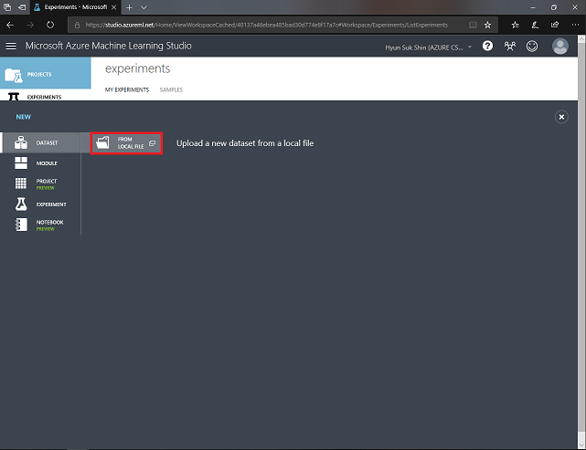
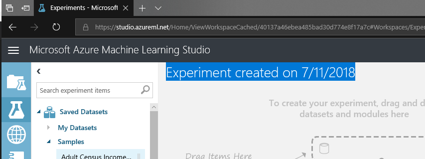

# Azure Machine Learning Studio 

## Login

Go to <a href="https:/studio.azureml.net/" target="_blank">Azure Machine Learning Studio</a> and login with your microsoft account.

Before you start experiment, make sure that your are in a right workspace. To make sure click on your name top right conner and select appropreate workshop.

## Basic guide 

### Upload dataset

Once you click one your workspace, you wil see Azure Machine Learning Studio. Before we start new experiment, let see how to upload sample dataset from your local pc to Azure Machine Learning Studio. To start the task, click [+ NEW] icon on the screen.

Click on [From Local File].

You can browse a file and upload it in the Upload a new dataset window. You can upload a file at a time but, you can upload multiple files at the same time by reapting this task.

### Start NEW experiment

You can start experiment by createing [Blank Experiment].

You'll see canvas in Azure Machine Learning Studio. You can drag and drop components from left panel to canvas. 

Step 5. Run the experiment

## Navigation

1. <a href="https://github.com/xlegend1024/az-mlstudio-hol/blob/master/NYCEnergyForecast/02.01.NYCEnergyForecast.md" target="_blank">New York Energy Demand Forecast</a>
Build score model and opertaionalize the model

1. <a href="https://github.com/xlegend1024/az-mlstudio-hol/blob/master/ServerWorkloadForecast/03.01.ServerWorkLoadForecast.md" target="_blank">Server Workload Forecast</a>
Compare different algorithms and tune hyperparameters to select best model 

1. <a href="https://github.com/xlegend1024/az-mlstudio-hol/blob/master/ServerWorkloadForecast/04.01.BikeshareDemandForecast.md" target="_blank">Bikeshare Demand Forecast</a>
Build forecast model to predict bikeshare demand
