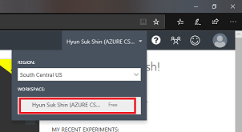
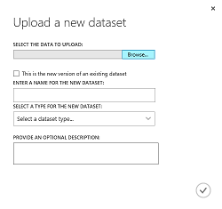
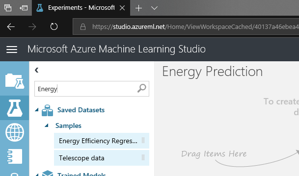

# Azure Machine Learning Studio 

## Login

## Create NEW experiment

## Basic usages 
Step 1. Add a dataset from samples

Step 2. Split dataset

Step 3. Select an ML algorithm

Step 4. Make predictions

Step 5. Run the experiment

## Navigation

1. <a href="https://github.com/xlegend1024/az-mlstudio-hol/blob/master/NYCEnergyForecast/02.01.NYCEnergyForecast.md" target="_blank">New York Energy Demand Forecast</a>
Build score model and opertaionalize the model

1. <a href="https://github.com/xlegend1024/az-mlstudio-hol/blob/master/ServerWorkloadForecast/03.01.ServerWorkLoadForecast.md" target="_blank">Server Workload Forecast</a>
Compare different algorithms and tune hyperparameters to select best model 

1. <a href="https://github.com/xlegend1024/az-mlstudio-hol/blob/master/ServerWorkloadForecast/04.01.BikeshareDemandForecast.md" target="_blank">Bikeshare Demand Forecast</a>
Build forecast model to predict bikeshare demand
