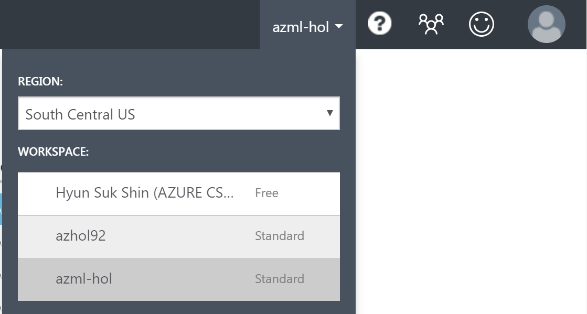
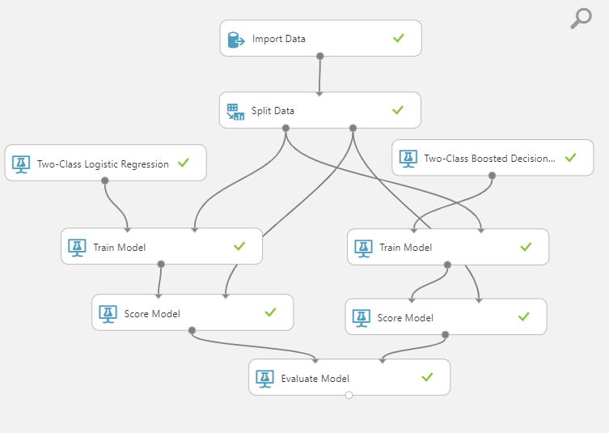

# 01. Modeling (Azure Machine Learning Studio)

## 1. Access ML Studio

Open a new browser or tap and go to [Azure ML Studio](https://studio.azureml.net)

__Click__ on sign in, if you are already loged in on Azure Portal, it'll automatically


When you logged in to the service, please make sure your workspace name is correct or not



## 3. Create a new experiment

__Click__ '+ NEW' and __click__ 'Blank Experiment'


### 3.1. Rename experiment

__Click__ on the title of the experiment, and name it as _azlab###_

### 3.2. Imoprt dataset

3.2.1. Get dataset url

__Search__ _import_ from the left search box and __drag and drop__ the import module to canvas

__Click__ on the _'Import Data'_ module

Chage some options in the properties on the left panel

|Name|Value|
|---|---|
|Data Source|Web URL via HTTP|
|Data Source URL|```https://raw.githubusercontent.com/xlegend1024/az-mlstudio-hol/master/CustomerChurn/customerchurnsource.csv```|
|Data format|csv|
|CSV or TSV has header|Check|
|Use cached resutls|Check|


__Click__ _'Run'_ button in the bottom of the canvas, then it will download the dataset from blob to Azure ML Studio in a  minute (around 10 sec)


### 3.3. Understand data

When the running is done, you will see green check mark on your right coner of the canvas

__Right click__ on the port of the module and __click__ on _'Visualize'_

From the visualize you can see summary informatio about the dataset


### 3.4. Split data

__Search__ _split Data_ from the left search box and __drag and drop__ the import module to canvas

And __drag__ _bottom port of Import Data module_ __drop__ to _top port of Split Data module_ to link between thoes two module


Update split ratio in the properites


### 3.5. Train

To trian the model we'll use:
* Two-Calss Logistic Regression
* Two-Class Boosted Decision Tree

And the label is 'Churn' since we are trying to build a machine learning to predict a customer  churn



---
[Next > 02. Operationalization](https://github.com/xlegend1024/az-mlstudio-hol/blob/master/CustomerChurn/02Operationalization.md)