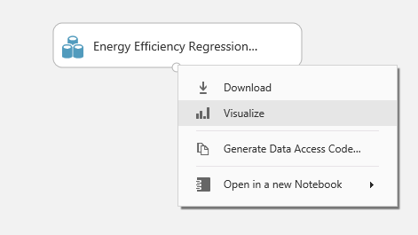
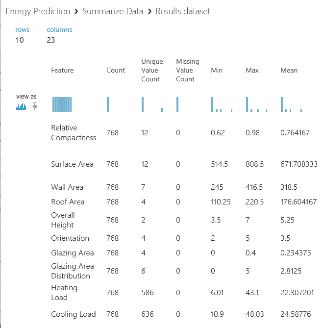

# I. Understand Data

## Create Energy Effiency Prediction Model (1/4)

This is first step of four steps.

1. Understand Data

1. Train Model

1. Evaluate Score

1. Deploy Mode 

***

### Azure Machine Learning Studio 

If you're not log on Azure Machine Learning Studio, go to <a href="https://studio.azureml.net/" target="_blank">Azure Machine Learning Studio</a>.

### 1. Start NEW experiment

__Click__ [+ NEW] and [Blank Experiment].

### 2. Rename experiment
You'll see canvas in Azure Machine Learning Studio. Before we do some experiment, update name of the experiment. __Click__ on tile and chage it to 'Energy Prediction'.

### 3. Load data

There are many ways you can load data you studio. Here you're going to use sample data that is loaded in Studio. To get the data, search 'Energy' on left search box. And then  drag and drop the 'Energy Efficiency Regression data' to canvas. 

### 4. Understand data

__Right click__ on the dataset, and __click__ 'Visualize'. 

You can see data distributions and statistics of each column. Also you can change histogram to boxplot to get insights from the data.

Additional statistics insight can be shows by using 'Summarize Data'. Search 'Summarize Data' module from left panel and drop the module on the canvas.

By makeing connection between 'Energy Efficiency Regression data' and 'Summarize Data' data will be flow into next module. Drag from bottom port of 'Energy Efficiency Regression data' port to upper port of 'Summarize Data' module.

__Click__ 'Run' to execute experiment.

After few seconds later, you'll see green check mark on each module. It means that each experiment of modules are done. __Right click__ on 'Summarize Data' and __click__ 'Visualize' from submenu.

You'll see like following results.

## NEXT
Continue this lab [Setp 2. Train Model](./02.02.TrainModel.md)

--- 

#### Navigation

1. <a href="https://github.com/xlegend1024/az-mlstudio-hol/blob/master/NYCEnergyForecast/01.01.NYCEnergyForecast.md" target="_blank">New York Energy Demand Forecast</a>
Build score model

1. <a href="https://github.com/xlegend1024/az-mlstudio-hol/blob/master/EnergyEfficiency/02.01.EnergyEfficiency.md" target="_blank">Energy Efficiency Forecast</a>
Build score model and opertaionalize the model

1. <a href="https://github.com/xlegend1024/az-mlstudio-hol/blob/master/ServerWorkloadForecast/03.01.ServerWorkLoadForecast.md" target="_blank">Server Workload Forecast</a>
Compare different algorithms and tune hyperparameters to select best model 

1. <a href="https://github.com/xlegend1024/az-mlstudio-hol/blob/master/ServerWorkloadForecast/04.01.BikeshareDemandForecast.md" target="_blank">Bikeshare Demand Forecast</a>
Build forecast model to predict bikeshare demand

## Upload dataset

Before you start new experiment, you can upload sample dataset from your local pc to Azure Machine Learning Studio. To start the task, click [+ NEW] icon on the screen.

Click on [From Local File].

You can browse a file and upload it in the Upload a new dataset window. You can upload a file at a time but, you can upload multiple files at the same time by reapting this task.

