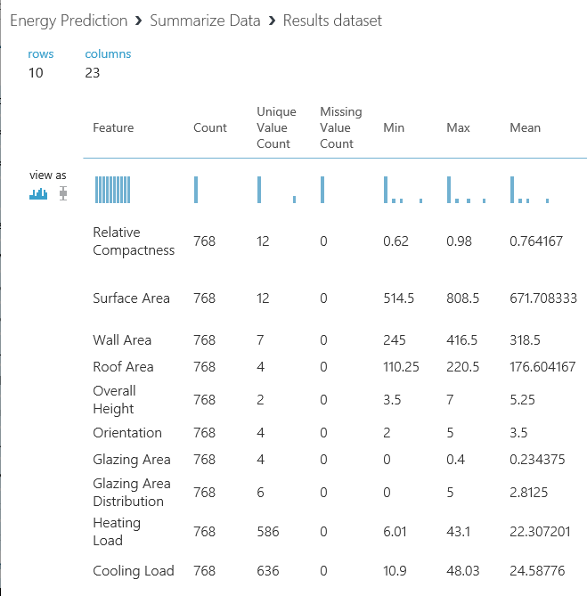
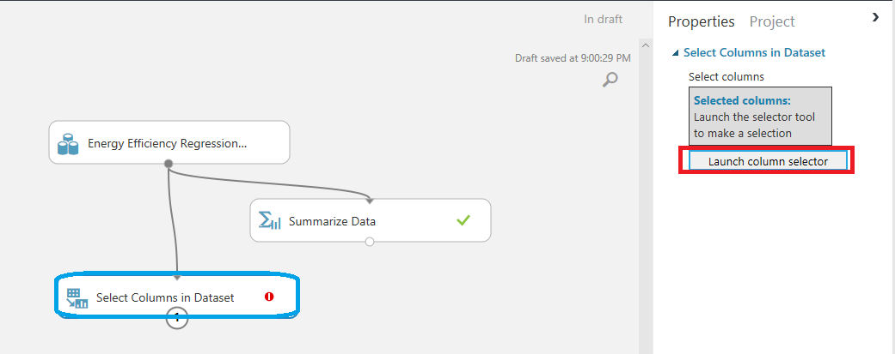
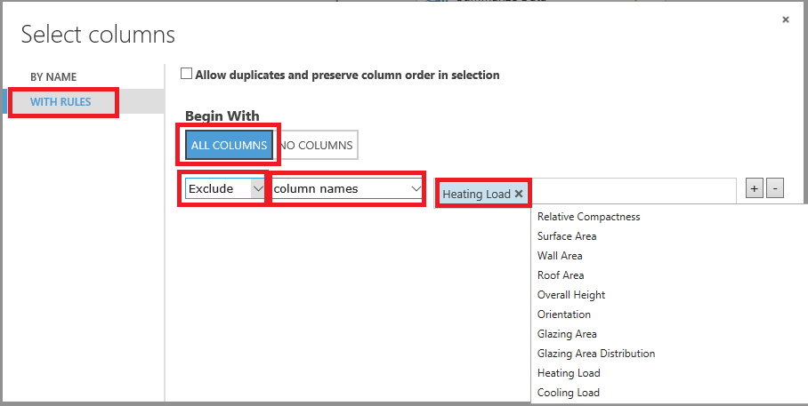
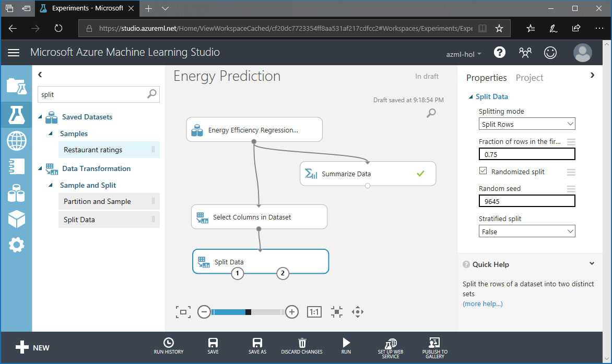
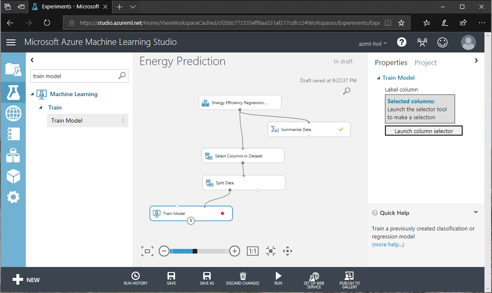
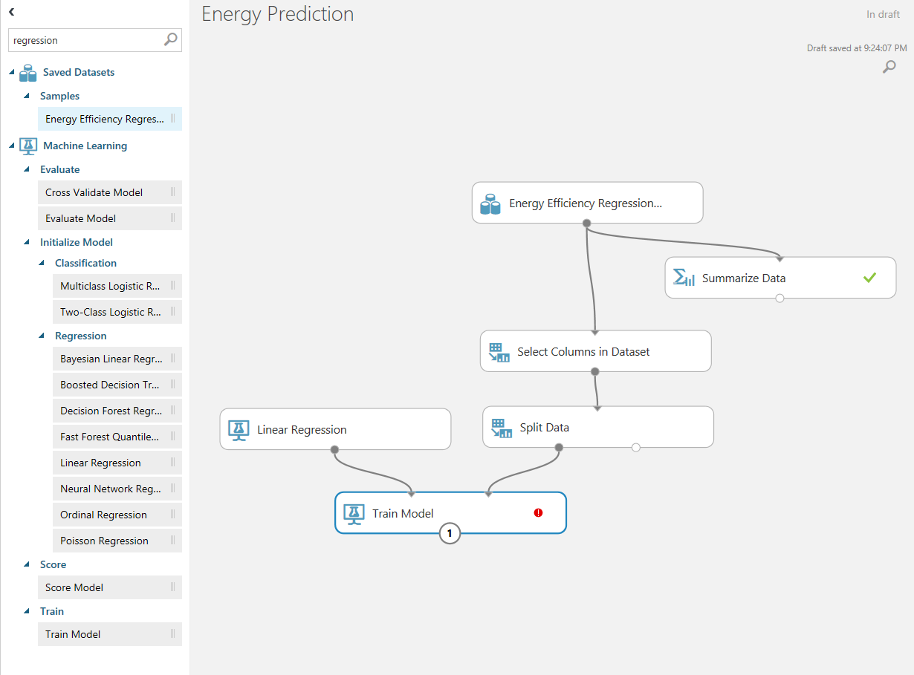
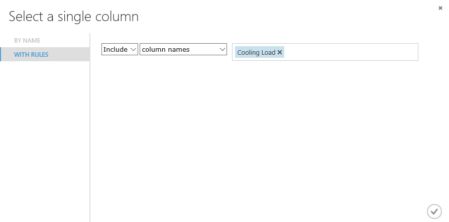
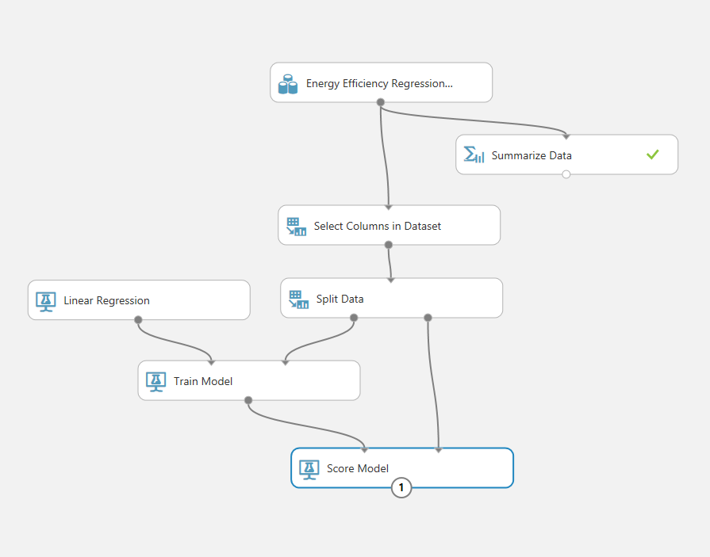

## Select columns

## Split data

## Select Algorithm

## Run Experiment

It'll take 30 seconds.

## NEXT
[Evaluate Scores](./02.03.EvaluateScore.md)

# Navigation

1. <a href="https://github.com/xlegend1024/az-mlstudio-hol/blob/master/NYCEnergyForecast/01.01.NYCEnergyForecast.md" target="_blank">New York Energy Demand Forecast</a>
Build score model

1. <a href="https://github.com/xlegend1024/az-mlstudio-hol/blob/master/EnergyEfficiency/02.01.EnergyEfficiency.md" target="_blank">Energy Efficiency Forecast</a>
Build score model and opertaionalize the model

1. <a href="https://github.com/xlegend1024/az-mlstudio-hol/blob/master/ServerWorkloadForecast/03.01.ServerWorkLoadForecast.md" target="_blank">Server Workload Forecast</a>
Compare different algorithms and tune hyperparameters to select best model 

1. <a href="https://github.com/xlegend1024/az-mlstudio-hol/blob/master/ServerWorkloadForecast/04.01.BikeshareDemandForecast.md" target="_blank">Bikeshare Demand Forecast</a>
Build forecast model to predict bikeshare demand