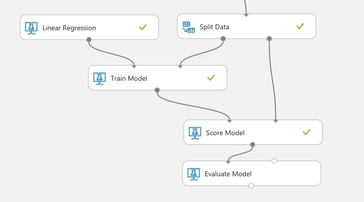
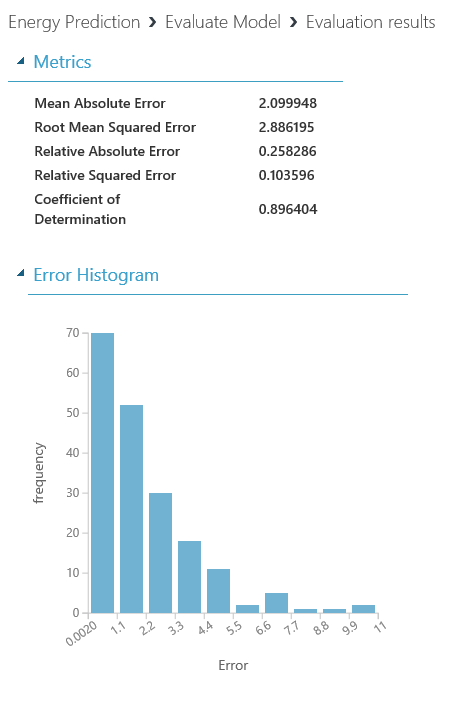
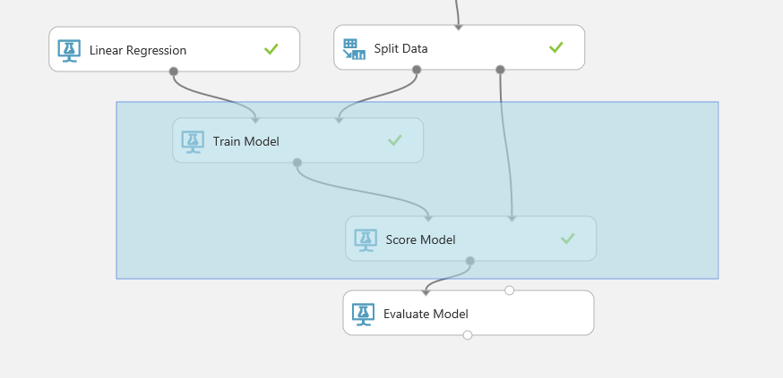
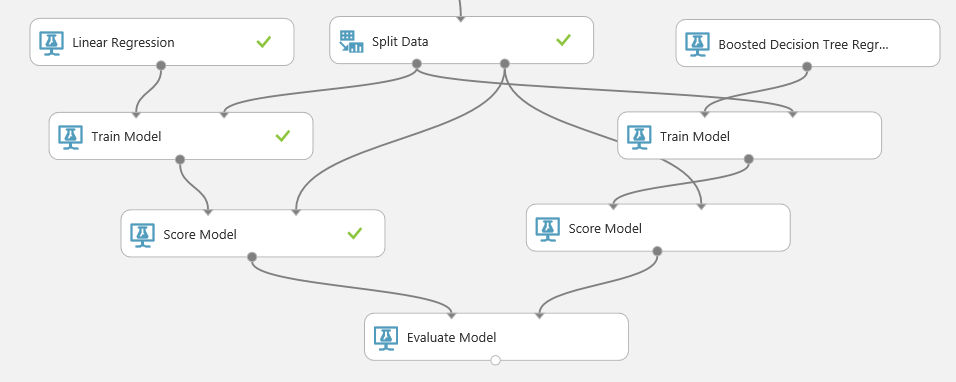
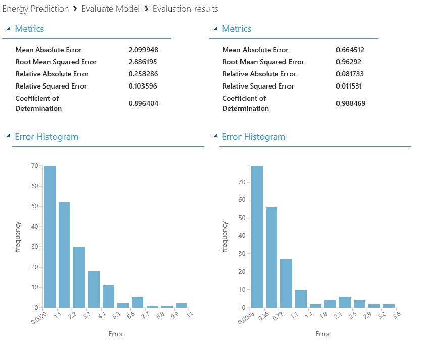

# III. Evaluate Scores

## Create Energy Effiency Prediction Model

This is third step of four steps.

1. Understand Data

1. Train Model

1. Evaluate Score

1. Deploy Mode 

***

## 10. Use Evaluation 

Search 'Evaluate Model'.

Run experiment and see result.

## 11. Compare with another algorithm

Copy and paste 'Train Model' and 'Score Model'.

Search 'Bossted Decision Tree Regression'. Run experiment.

See the result and choose better result for your preditcion.

## NEXT
[Deploy Model](./02.04.DeployModel.md)

--- 

#### Navigation

1. <a href="https://github.com/xlegend1024/az-mlstudio-hol/blob/master/NYCEnergyForecast/01.01.NYCEnergyForecast.md" target="_blank">New York Energy Demand Forecast</a>
Build score model

1. <a href="https://github.com/xlegend1024/az-mlstudio-hol/blob/master/EnergyEfficiency/02.01.EnergyEfficiency.md" target="_blank">Energy Efficiency Forecast</a>
Build score model and opertaionalize the model

1. <a href="https://github.com/xlegend1024/az-mlstudio-hol/blob/master/ServerWorkloadForecast/03.01.ServerWorkLoadForecast.md" target="_blank">Server Workload Forecast</a>
Compare different algorithms and tune hyperparameters to select best model 

1. <a href="https://github.com/xlegend1024/az-mlstudio-hol/blob/master/ServerWorkloadForecast/04.01.BikeshareDemandForecast.md" target="_blank">Bikeshare Demand Forecast</a>
Build forecast model to predict bikeshare demand
