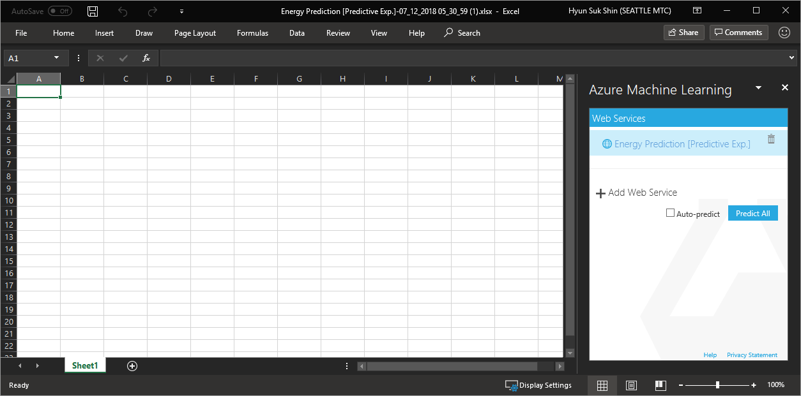

# IV. Deploy Model and Operationalization

## Create Energy Effiency Prediction Model (4/4)

This is fourth step of four steps.

1. Understand Data

1. Train Model

1. Evaluate Score

1. Deploy Mode

***

## 12. Choose Model

Click Train Model that is better than the other and then __click__ 'Predictive Web Services(Recommended)' of 'Set up Web Service'.

## 13. Prepare for deployment

Change connection link by deleting default connection and make new from 'web service input' to dataset input port of 'Score Model'. 

We don't need 'Cooling Load' label anymore. __Click__ 'Select Columns in Dataset' and __Select__ 'Cooling Load', and close the window.

## 14. Deploy web to operationalzation 

__Click__ 'Deploy Web Service [Classic]'.

## 15. Test in Excel

When web service provision is done, you will see following screen as a new tab/window on your browser. Click to download 'Excel 2013 or later' and open the excel file. 

> If you see popup windows like following, you need to __click__ okay to download the file.
>
> 

> If you see yellow warnning, __click__ 'Enable Editing' to contiue.
>
> 

You need to allow the Machine Learning add-in on Excel. Then you'll see Azure Machine Learning menu like following. __Click__ your machine learning service. 

__Click__ on 'Use sample data'. A table will be automatically popuated on your excel.

Type like following on your excel.

Once you fillout the form and __click__ 'Predict' button, you will see Scored Labels in your excel.

## 16. Simulate 

Change value such as, 'Overall Height' and see how prediction changes.

## NEXT

1. <a href="https://github.com/xlegend1024/az-mlstudio-hol/blob/master/ServerWorkloadForecast/03.01.ServerWorkLoadForecast.md" target="_blank">Server Workload Forecast</a>
Compare different algorithms and tune hyperparameters to select best model 

--- 

#### Navigation

1. <a href="https://github.com/xlegend1024/az-mlstudio-hol/blob/master/EnergyEfficiency/02.01.EnergyEfficiency.md" target="_blank">Energy Efficiency Forecast</a>
Build score model and opertaionalize the model

1. <a href="https://github.com/xlegend1024/az-mlstudio-hol/blob/master/ServerWorkloadForecast/03.01.ServerWorkLoadForecast.md" target="_blank">Server Workload Forecast</a>
Compare different algorithms and tune hyperparameters to select best model 
