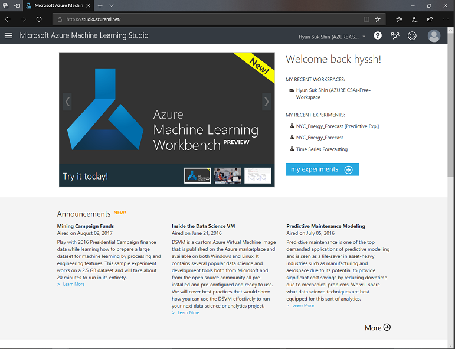
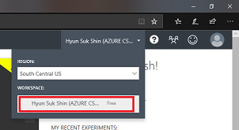

# Azure Machine Learning Studio Hands on lab

## Login to Azure Machine Learning Studio

Go to <a href="https://studio.azureml.net/" target="_blank">Azure Machine Learning Studio</a> and login with your microsoft account.

Before you start experiment, make sure that your are in a right workspace. To make sure click on your name top right conner and select appropreate workshop.

Once you click one your workspace, you wil see Azure Machine Learning Studio. You can start experiment by createing blank Experiment or Experiment Tutorial.
Continue hands on lab by clicking following lab.

## Hand on lab agenda
1. Go to <a href="https://github.com/xlegend1024/az-mlstudio-hol/blob/master/EnergyEfficiency/02.01.EnergyEfficiency.md" target="_blank">Energy Efficiency Forecast</a>

> Build score model and opertaionalize the model
> 30 mins

## Download Powerpotin Slide
<a href="https://github.com/xlegend1024/az-mlstudio-hol/blob/master/pptx/Azure%20ML%20Studio.pptx?raw=true" target="_blank">Download</a>