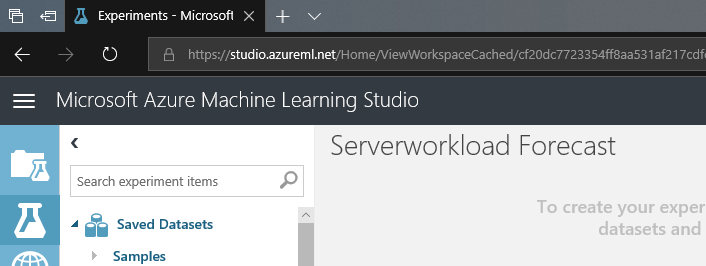

# I. Understand data

## Create Server load Prediction Model (1/4)

This is third step of four steps.

1. Understand Data

1. Train Model

1. Evaluate Model

1. Tune Model

***

## 1. Import Data 

Update name of this experiment for example, 'Serverworkload Forecast'.

Use following table for properties of 'Import Data' module.

|Name|Value|
|---|---|
|Data Source|Web URL via HTTP|
|URL|https://mtcsdataai.blob.core.windows.net/serverworkload/Serverworkload.csv|
|Data Format|CSV|
|Header|check|
|Cache|Check|

And __click__ 'Run' experiment.

> Since 35 MB of data source is being copied from  blob to your ML Studio, it may take 30 sec to 40 sec denpen on network.

## 2. Select features

Use 'Select Columns in Dataset' to select columns.

To select columns use numeric columns only option.

## 3. Clean Missing Data

Use 'Clean Missing Data' module to replace missing values to 0.

## 4. Select Features

Use 'Select Columns in Dataset' to select columns.

Select following columns for experiment.

|Columns|
|---|
|peakLoad dayofmonth hourofday Holiday month|

## NEXT
Continue this lab [Setp 2. Train Model](./03.02.TrainModel.md)

--- 

#### Navigation

1. <a href="https://github.com/xlegend1024/az-mlstudio-hol/blob/master/EnergyEfficiency/02.01.EnergyEfficiency.md" target="_blank">Energy Efficiency Forecast</a>
Build score model and opertaionalize the model

1. <a href="https://github.com/xlegend1024/az-mlstudio-hol/blob/master/ServerWorkloadForecast/03.01.ServerWorkLoadForecast.md" target="_blank">Server Workload Forecast</a>
Compare different algorithms and tune hyperparameters to select best model 