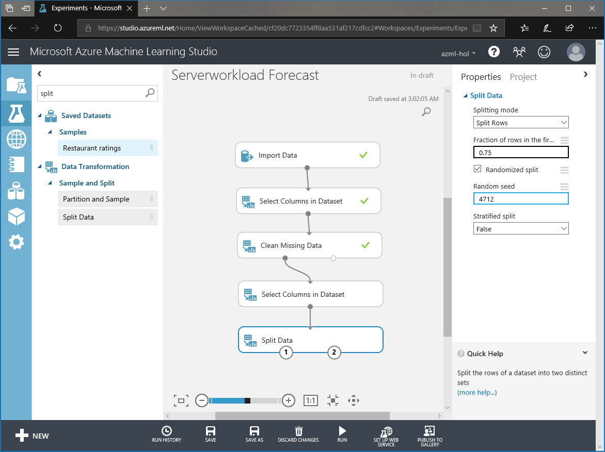
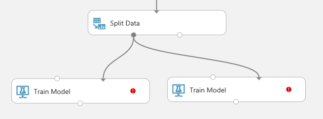
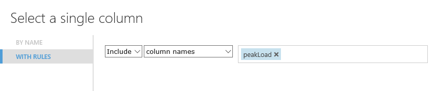
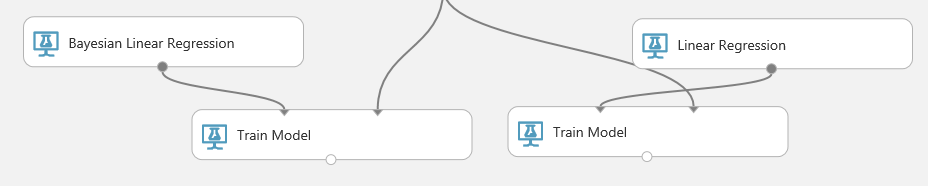
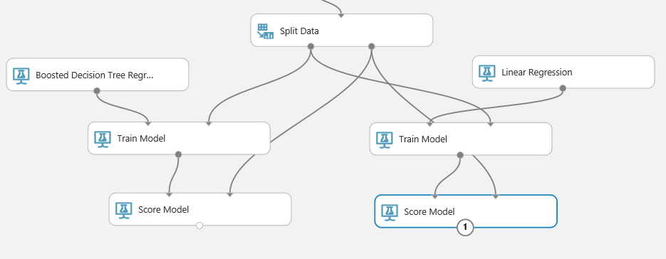

# II. Train Model

## Create Server load Prediction Model (2/4)

This is third step of four steps.

1. Understand Data

1. Train Model

1. Evaluate Model

1. Tune Model

***
## 5. Split Data

Use 'Split Data' module to split data into 75% for training and 25% for testing.

## 6. Train Model

Drop two 'Train Model' modules on canvas. And make connections from left output port of 'Split Data' to right input port on 'Train Model'. 

__Click__ 'Train Model' and click on 'Launch Column Selector' from properties and then __Select__ 'PeakLoad' for lable.

And use 'Boosted Decision Tree Regression' and 'Linear Regression' for this lab. And Make connection for each model and 'Train Model' module.

## 7. Score Model

To score models result, search and drop 'Score Model' module on canvas. Make connections for each 'Train Model' and 'Score Model'. __Click__ 'Run' to execute this experiment.

## NEXT
Continue this lab [Setp 3. Evaluate Model](./03.03.EvaluateModel.md)

--- 

#### Navigation

1. <a href="https://github.com/xlegend1024/az-mlstudio-hol/blob/master/NYCEnergyForecast/01.01.NYCEnergyForecast.md" target="_blank">New York Energy Demand Forecast</a>
Build score model

1. <a href="https://github.com/xlegend1024/az-mlstudio-hol/blob/master/EnergyEfficiency/02.01.EnergyEfficiency.md" target="_blank">Energy Efficiency Forecast</a>
Build score model and opertaionalize the model

1. <a href="https://github.com/xlegend1024/az-mlstudio-hol/blob/master/ServerWorkloadForecast/03.01.ServerWorkLoadForecast.md" target="_blank">Server Workload Forecast</a>
Compare different algorithms and tune hyperparameters to select best model 

1. <a href="https://github.com/xlegend1024/az-mlstudio-hol/blob/master/ServerWorkloadForecast/04.01.BikeshareDemandForecast.md" target="_blank">Bikeshare Demand Forecast</a>
Build forecast model to predict bikeshare demand