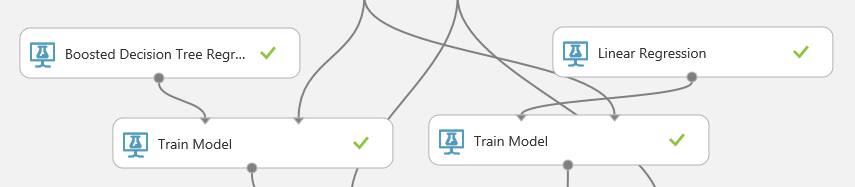
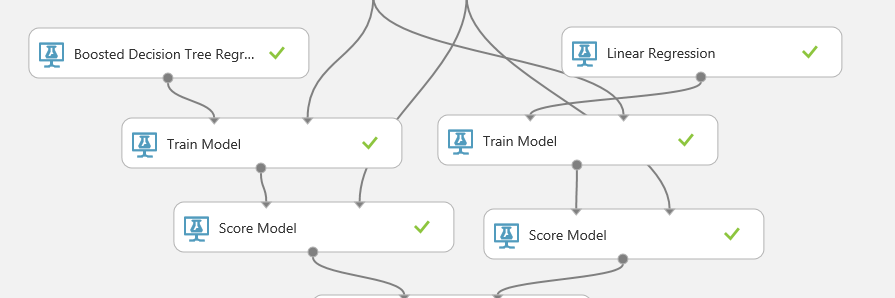

# II. Train Model

## Create Server load Prediction Model (2/4)

This is third step of four steps.

1. Understand Data

1. Train Model

1. Evaluate Model

1. Tune Model

***
## 4. Split Data

## 5. Train Model

Use two 'Train Model' modules on canvas. And make connections for each dataset inputs on 'Train Model'
And use 'Boosted Decision Tree Regression' and 'Linear Regression' for this lab.

__Select__ 'PeakLoad' for lable. And make connection for each model and 'Train Model' module.

## 6. Score Model

To score models, use 'Score Model' module. Make connections for each experiment.

## NEXT
Continue this lab [Setp 3. Evaluate Model](./03.03.EvaluateModel.md)

--- 

#### Navigation

1. <a href="https://github.com/xlegend1024/az-mlstudio-hol/blob/master/NYCEnergyForecast/01.01.NYCEnergyForecast.md" target="_blank">New York Energy Demand Forecast</a>
Build score model

1. <a href="https://github.com/xlegend1024/az-mlstudio-hol/blob/master/EnergyEfficiency/02.01.EnergyEfficiency.md" target="_blank">Energy Efficiency Forecast</a>
Build score model and opertaionalize the model

1. <a href="https://github.com/xlegend1024/az-mlstudio-hol/blob/master/ServerWorkloadForecast/03.01.ServerWorkLoadForecast.md" target="_blank">Server Workload Forecast</a>
Compare different algorithms and tune hyperparameters to select best model 

1. <a href="https://github.com/xlegend1024/az-mlstudio-hol/blob/master/ServerWorkloadForecast/04.01.BikeshareDemandForecast.md" target="_blank">Bikeshare Demand Forecast</a>
Build forecast model to predict bikeshare demand