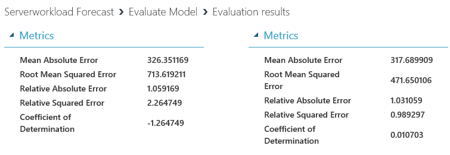

# III. Evaluate Model

## Create Server load Prediction Model (3/4)

This is third step of four steps.

1. Understand Data

1. Train Model

1. Evaluate Model

1. Tune Model

***

## 8. Use Evaluate  

Search and drop 'Evaluation Model' on canvas. Make connection between both 'Score Model's and the 'Evaluation Model'
'Run' the experiment and review 'Coefficient of Determination'.

Predictions are not good. Even Coefficient of Determination of 'Boosted Decision Tree Regression' shows negative value. It seems like we have problem.

## NEXT
Continue this lab [Setp 4. Tune Model](./03.04.TuneModel.md)

--- 

#### Navigation

1. <a href="https://github.com/xlegend1024/az-mlstudio-hol/blob/master/EnergyEfficiency/02.01.EnergyEfficiency.md" target="_blank">Energy Efficiency Forecast</a>
Build score model and opertaionalize the model

1. <a href="https://github.com/xlegend1024/az-mlstudio-hol/blob/master/ServerWorkloadForecast/03.01.ServerWorkLoadForecast.md" target="_blank">Server Workload Forecast</a>
Compare different algorithms and tune hyperparameters to select best model 