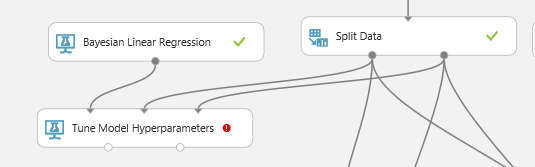
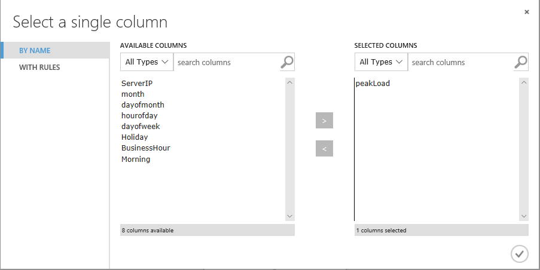
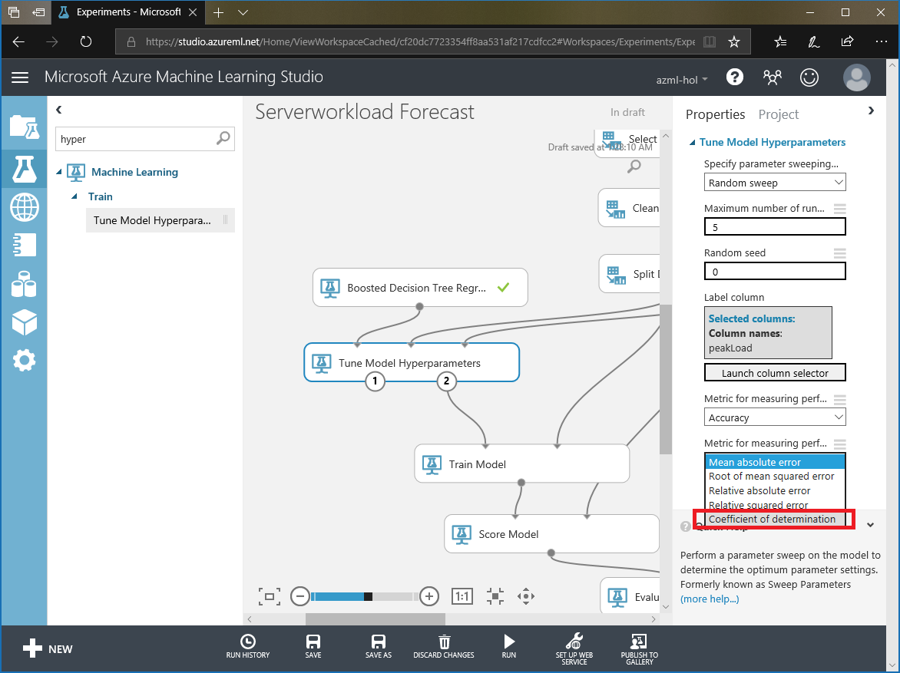
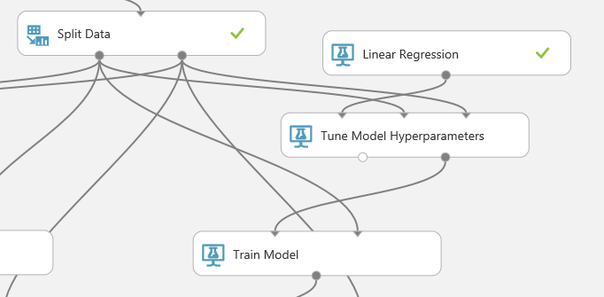
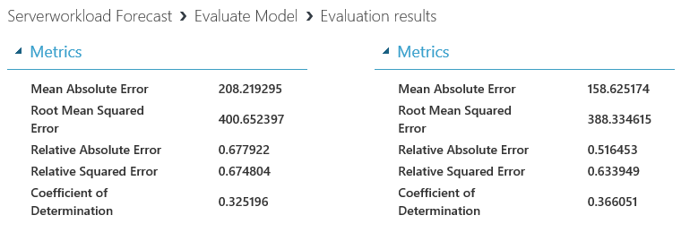
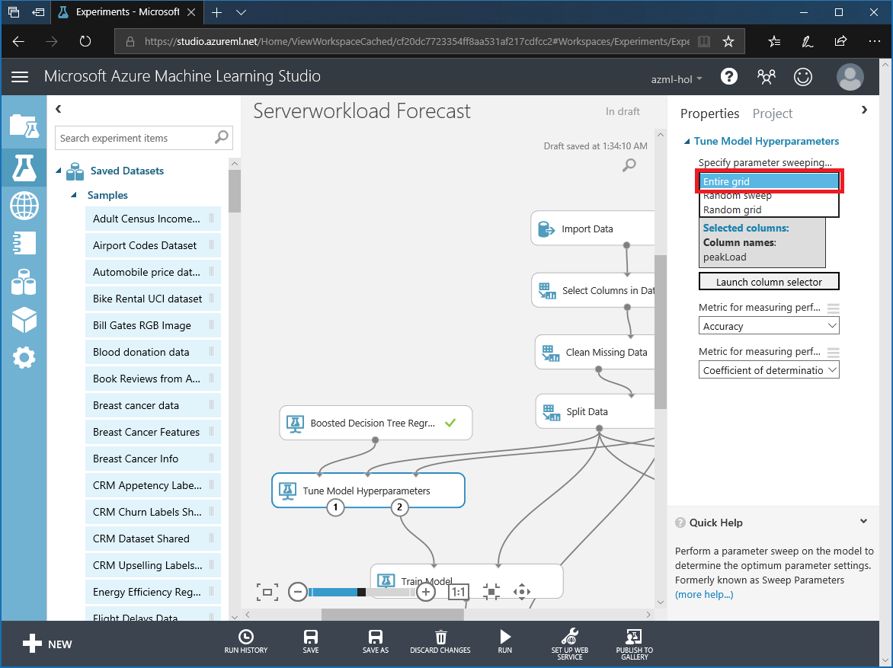

# IV. Tune Model 

## Create Server load Prediction Model (4/4)

This is third step of four steps.

1. Understand Data

1. Train Model

1. Evaluate Model

1. Tune Model

***

*This taks will take more than 14 mintues due to hyperparameter tunning.*

## 8. Tune Hyperparameter 

Use 'Tune Hyperparameter' module to find optimal hyperparameters.

Run experiment.

After the expriment, check how R2 has changed.

## 9. Tune Hyperparameter 

Change hyperparameter sweeping option to 'Entire grid' and __run__ experiment.

