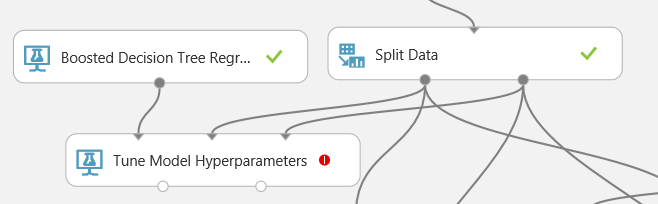
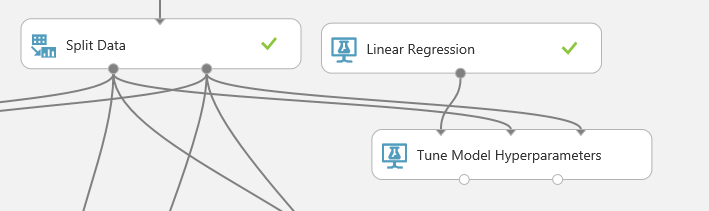
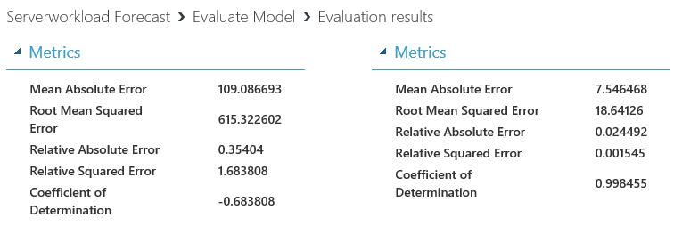
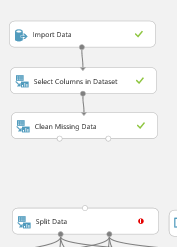

# IV. Tune Model 

## Create Server load Prediction Model (4/4)

This is third step of four steps.

1. Understand Data

1. Train Model

1. Evaluate Model

1. Tune Model

***

*This taks will take more than 14 mintues due to hyperparameter tunning.*

## 9. Tune Hyperparameter 

Use 'Tune Hyperparameter' module to find optimal hyperparameters.

__Select__ peakLoad for label.

__Select__ for parameter.

Make connection between 'Tune Model Hyperparameters' and 'Train Model'.

Run experiment.

After the expriment, check how R2 has changed.

## 9. Feature selection

Prediction is too low to use as a service. 
Delete lower 'Select Columns in Dataset' module and replace it to 'Filter Based Feature Selection' module.

Search and add 'Filter Based Feature Selection' on canvas.

__Select__ 'Filter Based Feature Selection' and select 'Spearman Correlation' for 'Feature scoring method'. And change 'Number of desired features' property from 1 to 8.

As a result, cofficient of Determination has increased.

## 10. Tune Hyperparameter 

Both models shows same R^2, so let's change one of model. Inseatd of , use 'Boosted Decision Tree Regression'

Change both hyperparameter sweeping option to 'Entire grid' and __run__ experiment.

It will take around 10 minutes.

