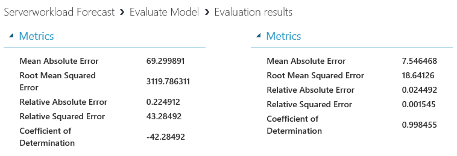
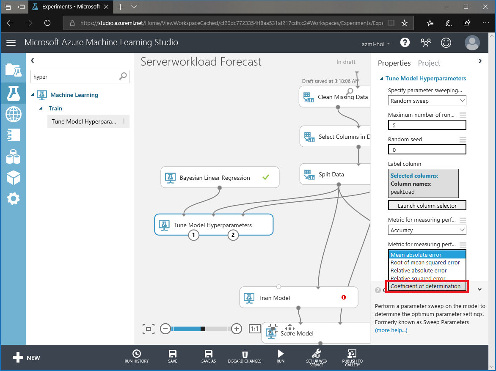

# IV. Tune Model 

## Create Server load Prediction Model (4/4)

This is third step of four steps.

1. Understand Data

1. Train Model

1. Evaluate Model

1. Tune Model

***

*This taks will take more than 14 mintues due to hyperparameter tunning.*

## 9. Feature selection

Prediction is too low to use as a service. Maybe feature we not good to predict 'peakLoad'.

Delete lower 'Select Columns in Dataset' module and replace it to 'Filter Based Feature Selection' module.

Search and add 'Filter Based Feature Selection' on canvas.

__Select__ 'Filter Based Feature Selection' and __select__ 'Spearman Correlation' for 'Feature scoring method'. And change 'Number of desired features' property from 1 to 8.

__Select__ 'Filter Based Feature Selection' and __select__ 'Launch column selector' to choose target column.

As a result, cofficient of Determination has increased.

## 10. Tune Hyperparameter 

Althought R^2 is increaed. still we see negative value of it. This time use 'Tune Model Hyperparameter' module to find optimal hyperparameters.

__Select__ 'Tune Model Hyperparameter' and __select__ 'Launch column selector' to choose label column. __Select__ peakLoad for label.

__Select__ 'Tune Model Hyperparameter' and __select__ 'Coefficient of Determination' for 'Metric for measuring performance for regression'

Do same thing to optimize for 'Linear Regression' module.

Make connection between 'Tune Model Hyperparameters' and 'Train Model'.

Run experiment.

After the expriment, check how results has changed.

    

## 10. Tune Hyperparameter 

Still we see negative value. This time you will change hyperparameter sweeping option.

Change both hyperparameter sweeping option to 'Entire grid' and __run__ experiment.

> It will take around 10 minutes.

Compare the results again and choose appropreate model for service.

--- 

#### Navigation

1. <a href="https://github.com/xlegend1024/az-mlstudio-hol/blob/master/EnergyEfficiency/02.01.EnergyEfficiency.md" target="_blank">Energy Efficiency Forecast</a>
Build score model and opertaionalize the model

1. <a href="https://github.com/xlegend1024/az-mlstudio-hol/blob/master/ServerWorkloadForecast/03.01.ServerWorkLoadForecast.md" target="_blank">Server Workload Forecast</a>
Compare different algorithms and tune hyperparameters to select best model 

